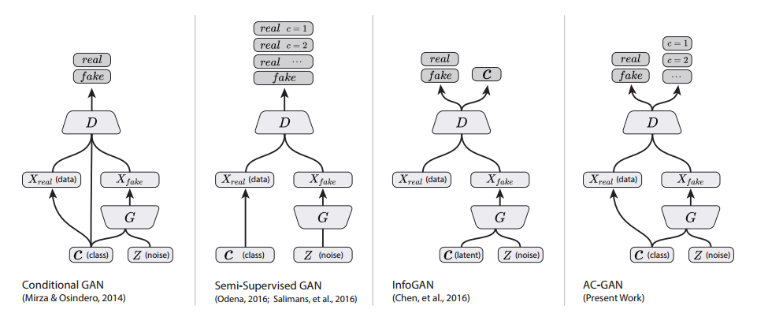

# Conditional Image Synthesis With Auxiliary Classifier GANs
This project is from [ACGAN-PyTorch](https://github.com/clvrai/ACGAN-PyTorch).
Just fix the code for implementing correctly. (PyTorch version)
Also, add the image generation code `generate_image.py`, if the checkpoint exists.


## Descriptions
This project is a [PyTorch](http://pytorch.org) implementation of [Conditional Image Synthesis With Auxiliary Classifier GANs](https://arxiv.org/abs/1610.09585).

<p align="center">
    
</p>

The sample generated images from ImageNet dataset.
<p align="center">
    
</p>

The sample generated images from CIFAR-10 dataset.
<p align="center">
    
</p>
## Prerequisites

- Python 3.8.5
- [PyTorch 1.8.0](http://pytorch.org)
- [SciPy](http://www.scipy.org/install.html)
- [NumPy](http://www.numpy.org/)
- [PIL](http://pillow.readthedocs.io/en/3.1.x/installation.html)
- [imageio](https://imageio.github.io/)

## Usage
Run the following command for details of each arguments.
```bash
$ python main.py -h
```
You should specify the path to the dataset you are using with argument --dataroot, the code will automatically check if you have cifar10 dataset downloaded or not. If not, the code will download it for you. For the ImageNet training you should download the whole dataset on their website, this repository used 2012 version for the training. And you should point the dataroot to the train (or val) directory as the root directory for ImageNet training.

In line 80 of main.py, you can change the classes\_idx argument to take into other user-specified imagenet classes, and adjust the num\_classes accordingly if it is not 10.
```python
if opt.dataset == 'imagenet':
    # folder dataset
    dataset = ImageFolder(root=opt.dataroot,
                          transform=transforms.Compose([
                              transforms.Scale(opt.imageSize),
                              transforms.CenterCrop(opt.imageSize),
                              transforms.ToTensor(),
                              transforms.Normalize((0.5, 0.5, 0.5), (0.5, 0.5, 0.5)),
                         ]),
                         classes_idx=(10,20))
```

### Train the models
Example training commands, the code will automatically generate images for testing during training to the --outf directory.
```bash
$ python main.py --niter=500 --batchSize=100 --cuda --dataset=cifar10 --imageSize=32 --dataroot=/data/path/to/cifar10 --gpu=0
```

### Extract learning images
``` shell scripts
    python generate_image.py --eval_epoch=/epoch/you/want --cuda --dataset=cifar10 --dataroot=/data/path/to/cifar10 --gpu=0 
```
